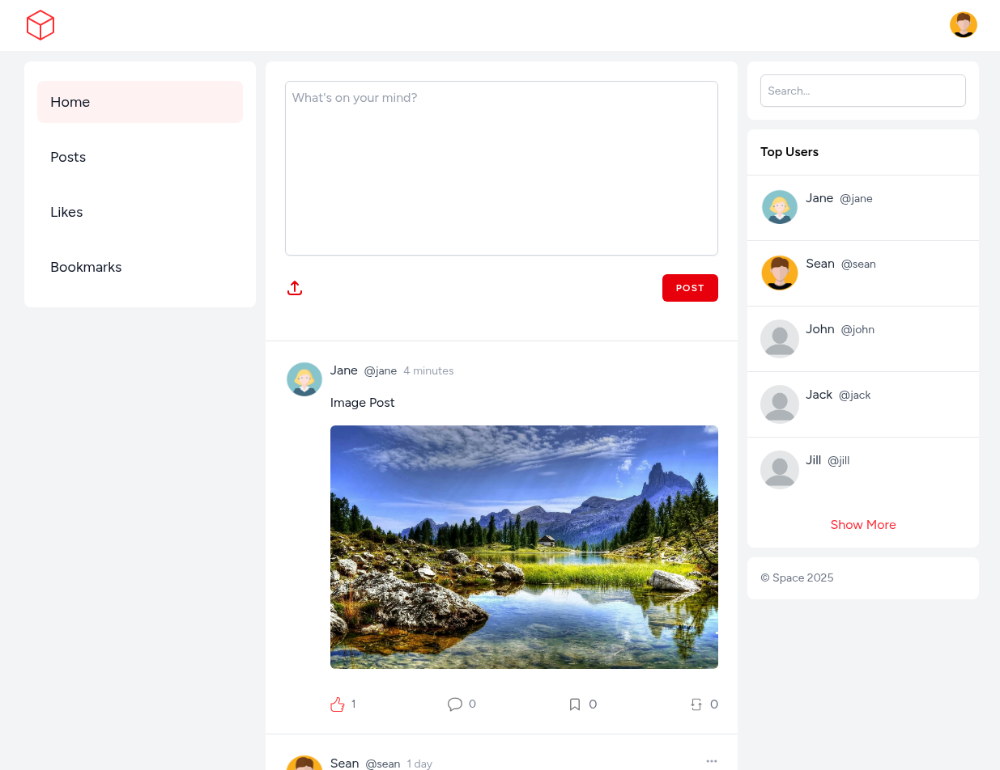

# Space

</a>

Space is a social microblogging application built with Laravel and Vue.js

## Installation

1. Run `git clone https://github.com/smtack/space.git && cd space`
2. Run `composer install`
3. Run `npm install`
4. Run `cp .env.example .env` and configure for your database/server
5. Run `php artisan key:generate` to generate APP_KEY
7. Run `php artisan migrate`
6. Run `composer run dev` to start the development server

To enable profile pictures and post images, create `avatars` and `images` folders in `storage/app/public`, then copy `default.webp` from `public/images` into `avatars` folder, and then run `php artisan storage:link`

## License

The Laravel framework is open-sourced software licensed under the [MIT license](https://opensource.org/licenses/MIT).
