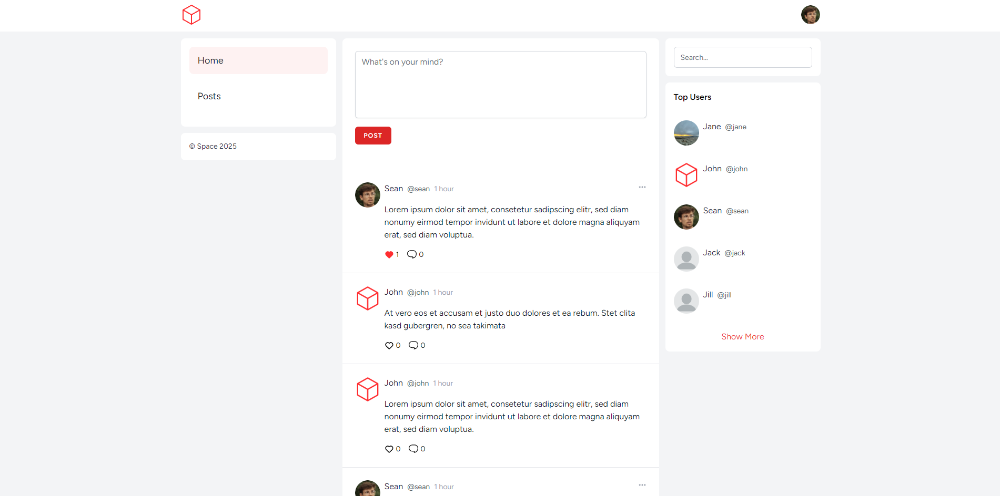

# Space

</a>

Space is a social microblogging application built with Laravel and Vue.js

## License

The Laravel framework is open-sourced software licensed under the [MIT license](https://opensource.org/licenses/MIT).
